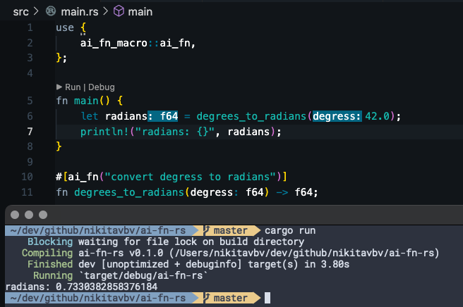

# ai-fn

`ai-fn` is a Rust macro that generates function implementation based on a text prompt using gpt-3.5-turbo.



This project is indended mainly for fun and learning purposes. However, you can try using this macros to generate simple boilerplate code.

## Usage

To use `ai-fn` macro, add the following dependency to your `Cargo.toml`:

```
ai-fn-macro = { git = "https://github.com/nikitavbv/ai-fn" }
```

Next, [obtain OpenAI token](https://platform.openai.com/account/api-keys) and save it to `.openai_api_token` file at the root of your project.

Use the macro to generate implementations of functions based on signature and text description. Here is an example:

```
use ai_fn_macro::ai_fn;

#[ai_fn("return if number is odd")]
fn is_odd(number: i32) -> bool;
```

Once you've annotated your function, you can simply call it like any other function:

```
fn main() {
    println!("is odd: {}", is_odd(42));
}
```